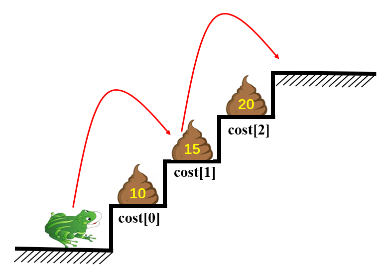

**动态规划**，英文：Dynamic Programming，简称DP，如果某一问题有很多重叠子问题，使用动态规划是最有效的。所以动态规划中每一个状态是由上一个状态推导出来的，这一点就区别于贪心，因为贪心没有状态推导，而是从局部直接选最优的

关于动态规划，这里学习了[@程序员Carl：关于动态规划，你该了解这些！](https://mp.weixin.qq.com/s?__biz=MzUxNjY5NTYxNA==&mid=2247486381&idx=1&sn=b8b913edabdab1208bf677b9578442e7&chksm=f9a238fcced5b1eae8b46972b5f4f9256651fd08d31e78d8aaaa530f56ee2919386cebb1da8a&scene=178&cur_album_id=1679142788606574595#rd)的经验，其将动态规划拆解为五个步骤：

- 确定$dp$数组（$dp\ table$）以及下标的含义
- 确定递推公式（状态转移公式）
- $dp$数组如何初始化
- 确定遍历顺序
- 距离推导$dp$数组

#### [198. 打家劫舍](https://leetcode-cn.com/problems/house-robber/)

你是一个专业的小偷，计划偷窃沿街的房屋。每间房内都藏有一定的现金，影响你偷窃的唯一制约因素就是相邻的房屋装有相互连通的防盗系统，**如果两间相邻的房屋在同一晚上被小偷闯入，系统会自动报警**。

给定一个代表每个房屋存放金额的非负整数数组，计算你 **不触动警报装置的情况下** ，一夜之内能够偷窃到的最高金额。

 **示例 1：**

```
输入：[1,2,3,1]
输出：4
解释：偷窃 1 号房屋 (金额 = 1) ，然后偷窃 3 号房屋 (金额 = 3)。
     偷窃到的最高金额 = 1 + 3 = 4 。
```

**示例 2：**

```
输入：[2,7,9,3,1]
输出：12
解释：偷窃 1 号房屋 (金额 = 2), 偷窃 3 号房屋 (金额 = 9)，接着偷窃 5 号房屋 (金额 = 1)。
     偷窃到的最高金额 = 2 + 9 + 1 = 12 。
```

 **提示：**

- `0 <= nums.length <= 100`
- `0 <= nums[i] <= 400`

**解题思路：**

1. $dp[i]$表示到了第$i$间房屋后，不管偷不偷该间房屋，口袋里拥有的最多钱数！

2. 决定$dp[i]$的因素就是第$i$间房屋偷还是不偷，而偷不偷的标准，是什么呢，当然是经历过这间房屋之后，口袋里的钱最多啦？那怎么样才能最多呢？当然是看：

   - 要偷这间房屋的话，必须保证$nums[i-1]$不能偷，则现在的钱数$dp[i]=dp[i-2]+nums[i]$
   - 不偷这间房屋的话，那么现在的金钱，即$dp[i] = dp[i-1]$
   - 所以偷还是不偷，即走过这间房屋之后，口袋里的钱有多少，即$dp[i]$为多少，当然是上述两种情况的最大值了

   状态转移方程：
   $$
   dp[i] = max(dp[i-2]+nums[i],dp[i-1])
   $$

3. $dp$数组的初始化：
   $$
   \begin{cases}
   dp[0] = nums[0] & \text{只有一间房屋则偷窃该房屋}\\
   dp[1] = max(nums[0], nums[1]) & \text{有两间房屋的话，选择金额大的进行偷窃}
   \end{cases}
   $$

4. $dp$数组的遍历：$dp[i]$是由$dp[i-2]$和$dp[i-1]$推导出来的，所以是从前向后遍历

```python
from typing import List
class Solution:
    def rob(self, nums: List[int]) -> int:
        N = len(nums)
        if N==0:    return 0
        if N==1:    return nums[0]
        dp = [0]*N      # dp[i]表示到了第i间房屋，不管偷不偷该间房屋，口袋里拥有的最多钱数
        dp[0] = nums[0]
        dp[1] = max(nums[0], nums[1])
        for i in range(2, N):
            dp[i] = max(dp[i-2]+nums[i], dp[i-1])
        return dp[-1]
```

```c++
#include<iostream>
#include<vector>
using namespace std;
class Solution {
public:
    int rob(vector<int>& nums) {
        int N=nums.size();
        if(N==0)    return 0;
        if(N==1)    return nums[0];
        vector<int> dp(N);
        dp[0] = nums[0];
        dp[1] = max(nums[0], nums[1]);
        for(int i=2; i<N; i++)
        {
            dp[i] = max(dp[i-2]+nums[i], dp[i-1]);
        }
        return dp[N-1];
    }
};
```

小结一下：

- 时间复杂度$O(N)$：需要遍历整个数组
- 空间复杂度$O(N)$：需要数组长度的$dp$数组来存取走到当前房屋时候的最大利益

参考资料：

- [@程序员Carl：动态规划：开始打家劫舍！](https://mp.weixin.qq.com/s/UZ31WdLEEFmBegdgLkJ8Dw)

- [@力扣官方题解：打家劫舍](https://leetcode-cn.com/problems/house-robber/solution/da-jia-jie-she-by-leetcode-solution/)

#### [509. 斐波那契数](https://leetcode-cn.com/problems/fibonacci-number/)

**斐波那契数**，通常用 `F(n)` 表示，形成的序列称为 **斐波那契数列** 。该数列由 `0` 和 `1` 开始，后面的每一项数字都是前面两项数字的和。也就是：

```
F(0) = 0，F(1) = 1
F(n) = F(n - 1) + F(n - 2)，其中 n > 1
```

给你 `n` ，请计算 `F(n)` 。

 **示例 1：**

```
输入：2
输出：1
解释：F(2) = F(1) + F(0) = 1 + 0 = 1
```

**示例 2：**

```
输入：3
输出：2
解释：F(3) = F(2) + F(1) = 1 + 1 = 2
```

**示例 3：**

```
输入：4
输出：3
解释：F(4) = F(3) + F(2) = 2 + 1 = 3
```

 **提示：**

- `0 <= n <= 30`

**解题思路：**

1. 我们需要输出$n$对应的斐波那契数值，所以我们的$dp$数组中$dp[i]$就表示第$i$个数的斐波那契数值

2. 确定状态转移方程，题目中其实已经给出了：
   $$
   dp[i] = dp[i-1]+dp[i-2]
   $$

3. $dp$数组的初始化，这里题目中也已经给出了：
   $$
   \begin{cases}
   dp[0]=0 \\
   dp[1]=1
   \end{cases}
   $$

4. 确定遍历顺序，根据状态转移方程可知，$dp[i]$是依赖$dp[i-1]$和$dp[i-2]$的，所以需要从左到右遍历

```python
class Solution:
    def fib(self, n: int) -> int:
        if n <=1:
            return n
        dp = [0]*(n+1)
        dp[0] = 0
        dp[1] = 1
        for i in range(2, n+1):
            dp[i] = dp[i-2] + dp[i-1]
        return dp[-1]
```

```c++
#include<iostream>
using namespace std;
class Solution {
public:
    int fib(int n) {
        if(n<=1)    return n;
        int dp[n+1];
        dp[0] = 0;
        dp[1] = 1;
        for(int i=2; i<n+1; i++)
        {
            dp[i] = dp[i-1] + dp[i-2];
        }
        return dp[n];
    }
};
```

小结一下：

- 时间复杂度：$O(N)$
- 空间复杂度：$O(N)$

参考资料：

- [@程序员Carl：动态规划：斐波那契数](https://mp.weixin.qq.com/s?__biz=MzUxNjY5NTYxNA==&mid=2247486389&idx=1&sn=c04a762fa0d83aad2ef8738aa659523b&chksm=f9a238e4ced5b1f21aee21c521fc9151e23cecebb13bfac0698b726efd80296e8975b172c44a&scene=178&cur_album_id=1679142788606574595#rd)

#### [746. 使用最小花费爬楼梯](https://leetcode-cn.com/problems/min-cost-climbing-stairs/)

数组的每个下标作为一个阶梯，第 `i` 个阶梯对应着一个非负数的体力花费值 `cost[i]`（下标从 `0` 开始）。

每当你爬上一个阶梯你都要花费对应的体力值，一旦支付了相应的体力值，你就可以选择向上爬一个阶梯或者爬两个阶梯。

请你找出达到楼层顶部的最低花费。在开始时，你可以选择从下标为 0 或 1 的元素作为初始阶梯。

 **示例 1：**

```
输入：cost = [10, 15, 20]
输出：15
解释：最低花费是从 cost[1] 开始，然后走两步即可到阶梯顶，一共花费 15 。
```

 **示例 2：**

```
输入：cost = [1, 100, 1, 1, 1, 100, 1, 1, 100, 1]
输出：6
解释：最低花费方式是从 cost[0] 开始，逐个经过那些 1 ，跳过 cost[3] ，一共花费 6 。
```

**提示：**

- `cost` 的长度范围是 `[2, 1000]`。
- `cost[i]` 将会是一个整型数据，范围为 `[0, 999]` 。

**解题之前：**

首先我真的想把这道题的题目稍微改一下，以方便理解：

- 一只井底之蛙的脑瓜忽然开窍了，想跳出找外面的蛙儿们玩耍，井虽然很深，但是有一个楼梯通往井口
- 这只青蛙待在井底太久了，缺乏锻炼造成了肌肉萎缩，所以它**一次铆足了劲最多也只能跳上两个台阶**，跳完就精疲力竭跳不动了，**得多少吃点东西才能继续跳**
- 幸好楼梯上有之前已经跳出去的蛙儿们拉下的屎，这只青蛙想，就算吃它们的屎我也得跳出去
- 问：**这只青蛙最少吃多少屎就能跳出去？**（青蛙在井底的时候，是有力气的，所以**在井底不吃屎就可以最多跳两个台阶**，且规定**每次吃屎必须把那层台阶的屎吃光**）

下图以题目中示例1的输入为例：



解释：这只青蛙本来的力气就是可以跳最多两个台阶的，它又想在吃最少屎的情况下跳到井口，那么只需要第一次跳两个台阶，跳上去之后了累了没劲了，但是吃光了了该台阶上的屎的时候，来劲了，再跳两个台阶就能找到其他蛙儿了

**解题思路：井底之蛙要吃屎**

这道题肯定是使用动态规划进行求解，首先必须明确一点，由上图中可以看出，虽然只有三个台阶上有屎，但是实际上青蛙面前实际上有四个台阶！

- 首先明确下 $dp$ 数组及其下标含义：$dp$ 数组的长度为 $len(cost)+1$（因为虽然有 $len(cost)$ 个台阶有屎，但是要想跳出去，还得多跳一次才能跳出去！所以可以理解为最后还有一个台阶得跳上去），其中 $dp[i]$ 表示青蛙跳到第 $i$ 个台阶上所需要的吃的最少的屎

- 确定状态转移方程，青蛙要是想到达第 $i$ 个台阶，只有两种方法：

  1. 从第 $i-1$ 个台阶上吃了该台阶上 $cost[i-1]$ 的屎跳上来，而在第 $i-1$ 个台阶的时候，青蛙已经吃了 $dp[i-1]$ 的屎
  2. 从第 $i-2$ 个台阶上吃了该台阶上 $cost[i-2]$ 的屎跳上来，而在第 $i-2$ 个台阶的时候，青蛙已经吃了 $dp[i-2]$ 的屎
  3. 如果是从第 $1$ 种方式（即从第 $i-1$ 个台阶）跳上来，那么青蛙在第 $i$ 个台阶的时候，就已经吃了 $dp[i-1]+cost[i-1]$ 的屎，如果是从第 $2$ 种方式（即从第 $i-2$ 个台阶）跳上来的话，那么青蛙在第 $i$ 个台阶的时候，就已经吃了 $dp[i-2]+cost[i-2]$ 的屎
  4. 所以当青蛙在第 $i$ 个台阶的时候，它要想当前自己吃的屎最少，就得看从第 $i-1$ 个台阶跳上来吃的屎少，还是从第 $i-2$ 个台阶跳上来吃的屎少

  所以状态转移方程就是这样：
  $$
  dp[i] = min(dp[i-1]+cost[i-1], dp[i-2]+cost[i-2])
  $$

- 现在我们就可以确定 $dp$ 数组的初值了，青蛙本来就可以不花力气跳到第 $0$ 个台阶或者第 $1$ 个台阶，所以：
  $$
  \begin{cases}
  dp[0]=0 \\
  dp[1]=0
  \end{cases}
  $$

- 第 $i$ 个台阶的吃屎量取决于之前的台阶，所以我们从前往后遍历 $cost$ 即可

```python
# Python3
class Solution:
    def minCostClimbingStairs(self, cost):
        n = len(cost)+1
        dp = [0] * n
        dp[0] = 0
        dp[1] = 0
        for i in range(2, n):
            dp[i] = min(dp[i - 1] + cost[i-1], dp[i - 2]+ cost[i-2])
        return dp[-1]
```

```c++
// C++
#include<iostream>
#include<vector>
using namespace std;
class Solution {
public:
    int minCostClimbingStairs(vector<int>& cost) {
        int N=cost.size()+1;
        int dp[N];
        dp[0] = 0;
        dp[1] = 0;
        for(int i=2; i<N; i++){
            dp[i] = min(dp[i-1]+cost[i-1], dp[i-2]+cost[i-2]);
        }
        return dp[N-1];
    }
};
```

小结一下：

- 时间复杂度：$O(N)$
- 空间复杂度：$O(N)$

参考资料：

- [@力扣官方题解：使用最小话费爬楼梯](https://leetcode-cn.com/problems/min-cost-climbing-stairs/solution/shi-yong-zui-xiao-hua-fei-pa-lou-ti-by-l-ncf8/)

- [@程序员Carl：动态规划：使用最小花费爬楼梯](https://mp.weixin.qq.com/s?__biz=MzUxNjY5NTYxNA==&mid=2247486432&idx=1&sn=5f449828e7fbe769540742e91b3fe13c&chksm=f9a238b1ced5b1a7036fd1068f77b6d997a4446ab9fbe01ab2c96631407ddaa3b8a844bf68fd&scene=178&cur_album_id=1679142788606574595#rd)

#### [62. 不同路径I](https://leetcode-cn.com/problems/unique-paths/)

一个机器人位于一个 `m x n` 网格的左上角 （起始点在下图中标记为 “Start” ）。

机器人每次只能向下或者向右移动一步。机器人试图达到网格的右下角（在下图中标记为 “Finish” ）。

问总共有多少条不同的路径？

 **示例 1：**


```
输入：m = 3, n = 7
输出：28
```

**示例 2：**

```
输入：m = 3, n = 2
输出：3
解释：
从左上角开始，总共有 3 条路径可以到达右下角。
1. 向右 -> 向下 -> 向下
2. 向下 -> 向下 -> 向右
3. 向下 -> 向右 -> 向下
```

**示例 3：**

```
输入：m = 7, n = 3
输出：28
```

**示例 4：**

```
输入：m = 3, n = 3
输出：6
```

 **提示：**

- `1 <= m, n <= 100`
- 题目数据保证答案小于等于 `2 * 109`

**解题思路：大家快来看啊，这只机器人不会走回头路**

这道题能够拆分成具有相同任务的小问题，所以我们可以尝试使用**动态规划**来做

- 首先**确定一下 $dp$ 数组及其下标表示的含义**，我们肯定是要新建维度和原矩阵一样的 $dp$ 数组，而 $dp[x][y]$ 就表示到达格子的 $[x][y]$ 这个位置有多少种不同的路径

- 然后确定一下**状态转移方程**，我们可以发现，要想到达 $Finish$ 格子的位置，可以从 $Finish$ 上面的格子走 $\downarrow$ 来，或者由 $Finish$ 左边的格子向 $\rightarrow$ 走过来，所以路径由这两部分组成，即：
  $$
  dp[x][y]=dp[x-1][y]+dp[x][y-1]
  $$

- 那 **$dp$ 数组的初值**该怎么确定呢？由上一步的**状态转移方程**可以看到，如果我们不知道 $dp$ 数组的第 $1$ 行和第 $1$ 列，我们是无法计算出走到 $Finish$ 的路径条数的，所以我们必须确定 $dp$ 数组的第 $1$ 行和第 $1$ 列的值。又因为这只机器人比较傻（其实所有机器人都比较傻），**只会向右 $\rightarrow$ 和向 $\downarrow$ 走**，所以如果该网格如果只有 $1$ 行（或 $1$ 列）的话，这只机器人就只能傻傻向 $\rightarrow$ （或向 $\downarrow$ ）走了，这种情况的话，路径是只有 $1$ 种的，**所以** **$dp$ 数组的第 $1$ 行和第 $1$ 列的值都为 $1$** ，所以：
  $$
  \begin {cases}
  dp[0][y]=1	& \text{机器人只会向 $\rightarrow$ ，所以和start在同一行的所有格子的路径只有1种}\\
  dp[x][0]=1	& \text{机器人只会向 $\downarrow$ ，所以和start在同一列的所有格子的路径只有1种}
  \end {cases}
  $$

- 这个时候我们可以考虑如何遍历 $dp$ 数组了，因为这是个网格，机器人只会向 $\rightarrow$ 或者向 $\downarrow$ 走的这两种选择，而网格即使转置了之后，机器人依然是只会 $\rightarrow$ 和 $\downarrow$ 的，所以**无论是按行遍历还是按列遍历，最终也都会遍历到 $Finish$ 格子**，且当遍历到 $Finish$ 格子的时候， $dp$ 数组的所有格子也都遍历到了，所以这两种遍历都是可以的

```python
# Python3
class Solution:
    def uniquePaths(self, m: int, n: int) -> int:
        if m==1 or n==1:    return 1
        dp = [[1]*n for _ in range(m)]
        for x in range(1, m):
            for y in range(1, n):
                dp[x][y] = dp[x-1][y] + dp[x][y-1]
        return dp[-1][-1]
```

```c++
// C++
#include <iostream>
#include <vector>
using namespace std;
class Solution {
public:
    int uniquePaths(int m, int n) {
        if(m==1 || n==1)    return 1;
        vector<vector<int>> dp(m, vector<int>(n, 1));
        for(int x=1; x<m; x++){
            for(int y=1; y<n; y++){
                dp[x][y] = dp[x-1][y] + dp[x][y-1];
            }
        }
        return dp.back().back();
    }
};
```

小结一下：

- 时间复杂度：$O(mn)$ ，因为需要遍历 $m*n$ 维的 $dp$ 数组
- 空间复杂度：$O(mn)$，需要 $m*n$ 维的 $dp$ 数组来存储到达每个位置的不同路径数
- 当然这道题还有别的方法，这里主要讲动态规划，所以只给出了动态规划的解法

#### [63. 不同路径 II](https://leetcode-cn.com/problems/unique-paths-ii/)

一个机器人位于一个 *m x n* 网格的左上角 （起始点在下图中标记为“Start” ）。

机器人每次只能向下或者向右移动一步。机器人试图达到网格的右下角（在下图中标记为“Finish”）。

现在考虑网格中有障碍物。那么从左上角到右下角将会有多少条不同的路径？

网格中的障碍物和空位置分别用 `1` 和 `0` 来表示。

**示例 1：**

```
输入：obstacleGrid = [[0,0,0],[0,1,0],[0,0,0]]
输出：2
解释：
3x3 网格的正中间有一个障碍物。
从左上角到右下角一共有 2 条不同的路径：
1. 向右 -> 向右 -> 向下 -> 向下
2. 向下 -> 向下 -> 向右 -> 向右
```

**示例 2：**

```
输入：obstacleGrid = [[0,1],[0,0]]
输出：1
```

 **提示：**

- `m == obstacleGrid.length`
- `n == obstacleGrid[i].length`
- `1 <= m, n <= 100`
- `obstacleGrid[i][j]` 为 `0` 或 `1`

**解题思路：不会走回头路的机器人，也会过障碍**

这道题和这道题[62.不同路径I](https://leetcode-cn.com/problems/unique-paths/)基本思路是一样的，虽然有了障碍，但是只要我们明确 $dp$ 数组及其下标的含义，还有初始化 $dp$ 数组的真正原因，就会觉得即使有了障碍，这道题目也是很简单的

1. 确定 $dp$ 数组及其下标的含义：我们用 $dp[x][y]$ 表示达到 $[x][y]$ 位置有多少条路径

2. 确定状态转移方程，首先我们要明确，当 $[x][y]$ 位置上有障碍的时候，到达这个位置的路径条数为 $0$ ，从这个位置到它右边和下边的位置的路径条数也为 $0$ ，所以：
   $$
   \begin{cases}
   dp[x][y]=0 &\text{这个位置有障碍}\\
   dp[x][y]=dp[x-1][y]+dp[x][y-1]	&\text{这个位置没有障碍}
   \end{cases}
   $$

3.  $dp$ 数组的初始化。上个题目中，我们讲到了，和机器人的初始位置在同一行和同一列的 $dp$ 数组需要初始化为 $1$ ，因为机器人的方向决定了只能有一条路径到达那里，而现在有了障碍物，又决定了能不能到达那里，所以障碍物之后的位置，机器人是到到达了那里的，所以应该初始化为 $0$ 

4. 现在我们只需要按行，或者按列遍历数组都可以

```python
# Python3
from typing import List
class Solution:
    def uniquePathsWithObstacles(self, obstacleGrid: List[List[int]]) -> int:
        M, N = len(obstacleGrid), len(obstacleGrid[0])
        dp = [[0]*N for _ in range(M)]  # 新建dp数组，用来保存到达某个位置的路径条数
        for x in range(M):
            if obstacleGrid[x][0]==1:
                break   # 第一行如果有了障碍物，障碍物之后的位置机器人都到达不了，所以路径条数为0
            dp[x][0] = 1
        for y in range(N):
            if obstacleGrid[0][y]==1:
                break   # 第一列如果有了障碍物，障碍物下面的位置机器人都到达不了，所以路径条数为0
            dp[0][y] = 1
        for x in range(1, M):
            for y in range(1, N):
                if obstacleGrid[x][y] ==1:
                    dp[x][y] = 0    # 如果某个位置遇到障碍物了，到达这个位置的路径条数就位0
                else:
                    dp[x][y] = dp[x-1][y]+dp[x][y-1]
        return dp[-1][-1]
```

```c++
# C++
#include <iostream>
#include <vector>
using namespace std;
class Solution {
public:
    int uniquePathsWithObstacles(vector<vector<int>>& obstacleGrid) {
        int M=obstacleGrid.size(), N=obstacleGrid[0].size();
        vector<vector<int>> dp(M, vector<int>(N, 0));   //新建dp数组，用来保存到达某个位置的路径条数
        for(int x=0; x<M; x++){
            if(obstacleGrid[x][0]==1)   break;  //第一行如果有了障碍物，障碍物之后的位置机器人都到达不了，所以路径条数为0
            dp[x][0] = 1;   
        }
        for(int y=0; y<N; y++){
            if(obstacleGrid[0][y]==1)   break;  //第一列如果有了障碍物，障碍物下面的位置机器人都到达不了，所以路径条数为0
            dp[0][y] = 1;
        }
        for(int x=1; x<M; x++){
            for(int y=1; y<N; y++){
                if(obstacleGrid[x][y]==1)   dp[x][y]=0; //如果某个位置遇到障碍物了，到达这个位置的路径条数就位0
                else    dp[x][y] = dp[x-1][y]+dp[x][y-1];
            }
        }
        return dp.back().back();
    }
};
```

小结一下：

- 时间复杂度：$O(mn)$ ，因为需要遍历 $m*n$ 维的 $dp$ 数组
- 空间复杂度：$O(mn)$，需要 $m*n$ 维的 $dp$ 数组来存储到达每个位置的不同路径数