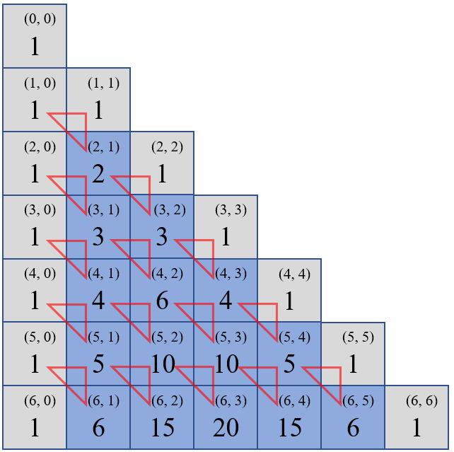
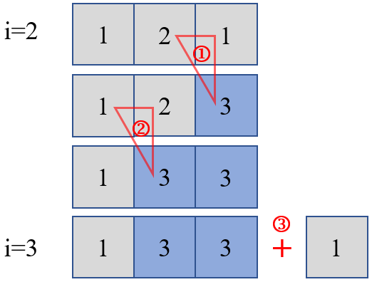

#### [119. 杨辉三角 II](https://leetcode-cn.com/problems/pascals-triangle-ii/)

给定一个非负索引 *k*，其中 *k* ≤ 33，返回杨辉三角的第 *k* 行。


在杨辉三角中，每个数是它左上方和右上方的数的和。

**示例:**

```
输入: 3
输出: [1,3,3,1]
```

**进阶：**

你可以优化你的算法到 *O*(*k*) 空间复杂度吗？

#### **解法一：逐行生成**

*这道题的“[118. 杨辉三角](https://leetcode-cn.com/problems/pascals-triangle/)”是去年12月份的一道每日一题，当时自己才刚开始刷题，连这么简单的题都没有做出来*

解题思路：

1. 首先说明一下，118那道题的索引是从1开始的，为方便并和119这道题统一起见，这里的索引都是从0开始，即第0行是[1]
2. 杨辉三角的定义：每个数是它左上方和右上方的数之和，所以这里和斐波那契数列一样，先定义前两行：[[1], [1, 1]]
3. 每一行的第一个数和最后一个数都是1，所以并不需要考虑这首尾的数，然后中间的数，就可以依据上一行的数进行相加
4. 具体相加的方法是（这里不考虑首尾的两个1），在第i行中，每j个元素的值为第i-1行的第j个元素和第j-1个元素的和（具体到数组里，我们可以认为是每个元素=它上面的元素+它上面元素的左边的元素）。执行完中间元素的相加操作之后，还需要在这一行的最后增加一个元素1
5. 依次规律，逐行进行求解，直到i=k

具体方法如下图所示（蓝色框代表需要进行相加的元素，红色三角框代表相加操作）：



```python
class Solution:
    def getRow(self, rowIndex: int):
        res = [[1],
               [1, 1]]
        if rowIndex<=1:
            return res[:rowIndex+1]
        for i in range(2, rowIndex+1):
            temp = [1]
            for j in range(1, i):
                temp.append(res[i-1][j-1] + res[i-1][j])
            temp.append(1)
            res.append(temp)
        return res
```

这样的思路比较容易理解，但是这种方法的空间复杂度为O(k*(k+1)/2)，因为我们需要将第k行之前的所有行都求出来并保存下来。而这道题有进阶要求，希望我们能达到O(k)的空间复杂度

#### **解法二：原地操作**

解题思路：

1. 还是跟上述的操作一样，当i<=1的时候，算是特殊情况，特殊处理
2. 首先先从右往左操作（从左往右也可以，但是索引观看起来不直观），杨辉三角的定义是：每个元素=它左上方的元素+右上方的元素，而具体到数组里，我们可以认为是每个元素=它上面的元素+它上面元素的左边的元素。而这样的操作是可以原地进行的，这样就可以将空间复杂度降低到O(k)了
3. 注意，这种方法操作到每行索引为1的元素的时候，执行完该元素就终止了。然后再在尾端增加一个元素1

具体方法如下图所示（以i=2的行操作到i=3的行为例，蓝色框代表需要进行相加的元素，红色三角框代表相关操作及其操作顺序）：



这种方法就可以将空间复杂度降低到O(k)了

```python
class Solution:
    def getRow(self, rowIndex: int):
        if rowIndex <= 1:
            return [1] * (rowIndex + 1)
        res = [1, 1]
        for i in range(2, rowIndex + 1):
            for j in range(i - 1, 0, -1):
                res[j] = res[j] + res[j - 1]
            res.append(1)
        return res
```

 