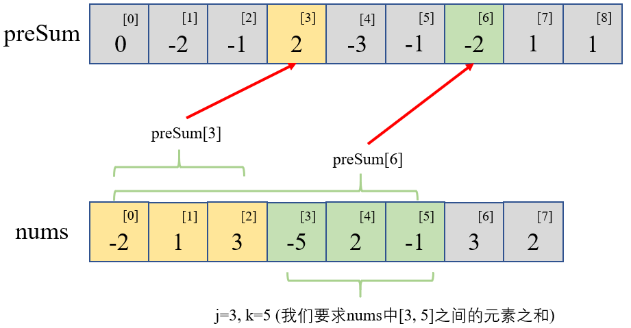

#### [303. 区域和检索 - 数组不可变](https://leetcode-cn.com/problems/range-sum-query-immutable/)

给定一个整数数组  `nums`，求出数组从索引 `i` 到 `j`*（*`i ≤ j`）范围内元素的总和，包含 `i`、`j `两点。

实现 `NumArray` 类：

- `NumArray(int[] nums)` 使用数组 `nums` 初始化对象
- `int sumRange(int i, int j)` 返回数组 `nums` 从索引 `i` 到 `j`*（*`i ≤ j`）范围内元素的总和，包含 `i`、`j `两点（也就是 `sum(nums[i], nums[i + 1], ... , nums[j])`）

 **示例：**

```
输入：
["NumArray", "sumRange", "sumRange", "sumRange"]
[[[-2, 0, 3, -5, 2, -1]], [0, 2], [2, 5], [0, 5]]
输出：
[null, 1, -1, -3]

解释：
NumArray numArray = new NumArray([-2, 0, 3, -5, 2, -1]);
numArray.sumRange(0, 2); // return 1 ((-2) + 0 + 3)
numArray.sumRange(2, 5); // return -1 (3 + (-5) + 2 + (-1)) 
numArray.sumRange(0, 5); // return -3 ((-2) + 0 + 3 + (-5) + 2 + (-1))
```

 **提示：**

- `0 <= nums.length <= 104`
- `-105 <= nums[i] <= 105`
- `0 <= i <= j < nums.length`
- 最多调用 `104` 次 `sumRange` 方法

#### 解法一：这就是前缀和该干的事

解题思路：前缀和

1. 一般我们在新建**前缀和数组** $preSum$ 的时候，都将 $preSum$ 数组的长度设为 $len(nums)+1$ ，因为我们**希望** **$preSum[i]$ 表示的是 $nums[0, i)$ 的元素之和，即不包括 $nums[i]$ 元素**。举个栗子，我们希望用 $preSum[0]$ 表示 $nums[0]$ 之前的元素和，但是 $nums[0]$ 之前没有元素，和为 $0$，所以一般上我们的 $preSum$ 数组的第一个元素都为 $0$ ，而 $preSum$ 的长度为 $len(nums)+1$ 

2. 遍历 $nums$ ，计算完 $preSum$ 之后，我们就可以利用 $preSum$ 的性质，计算任意区间 $[j, k]$ 之间的元素和了（这里前闭后闭，即包括 $nums[j]$ 和 $nums[k]$ 这两个元素）：
   $$
   \sum_{i=j}^k nums[i] = preSum[k+1]-preSum[j]
   $$

3. 这里可以用一张图稍微解释一下，为什么我们是用 $preSum[k+1]$ 减去 $preSum[j]$ ，首先我们必须再次确认的是 $preSum[j]$ 表示的是 $nums[j]$ 之前的元素的和（不包括 $nums[j]$ ）：

   

4. 从上图中可以看出，$preSum[3]$ 包含了 $nums$ 中 $[0,2]$ 之间的元素，而 $preSum[6]$ 包含了 $nums$ 中 $[0,5]$ 之间的元素，$[0,5]$ 的区间减去 $[0,2]$ 的区间，剩下的正好是 $[3,5]$ 区间

```python
# Python3
from typing import List
class NumArray:

    def __init__(self, nums: List[int]):
        self.preSum = [0]
        for each in nums:
            self.preSum.append(self.preSum[-1]+each)

    def sumRange(self, i: int, j: int) -> int:
        return self.preSum[j+1] - self.preSum[i]
```

```c++
// C++
#include <iostream>
#include <vector>
using namespace std;
class NumArray {
public:
    vector<int> preSum = {0};
    
    NumArray(vector<int>& nums) {
        int N=nums.size();
        for(int i=0; i<N; i++){
            preSum.push_back(preSum.back()+nums[i]);
        }
    }
    
    int sumRange(int i, int j) {
        return preSum[j+1] - preSum[i];
    }
};
```

复杂度分析：

- 时间复杂度：$O(n)$ ，需要遍历一遍 $nums$ 来求 $preSum$
- 空间复杂度：$O(n)$ ，需要存储 $(n+1)$ 长度的 $preSum$ 数组

____

这是我第**29**篇题解，也是[@Dean](https://leetcode-cn.com/u/dean-98543/)连续刷题打卡的第**42**天，希望能找到可以一起刷题一起进步的小伙伴~

**刷题小白，编程语言也不熟悉，如有错误的地方，还请各位大佬多多指教~**