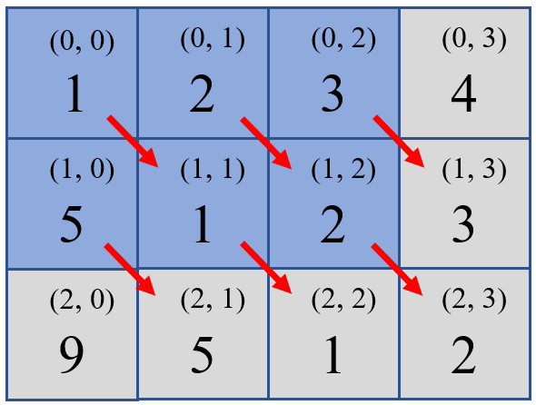

#### [766. 托普利茨矩阵](https://leetcode-cn.com/problems/toeplitz-matrix/)

给你一个 `m x n` 的矩阵 `matrix` 。如果这个矩阵是托普利茨矩阵，返回 `true` ；否则，返回 `false` *。*

如果矩阵上每一条由左上到右下的对角线上的元素都相同，那么这个矩阵是 **托普利茨矩阵** 。

 **示例 1：**


```
输入：matrix = [[1,2,3,4],[5,1,2,3],[9,5,1,2]]
输出：true
解释：
在上述矩阵中, 其对角线为: 
"[9]", "[5, 5]", "[1, 1, 1]", "[2, 2, 2]", "[3, 3]", "[4]"。 
各条对角线上的所有元素均相同, 因此答案是 True 。
```

**示例 2：**


```
输入：matrix = [[1,2],[2,2]]
输出：false
解释：
对角线 "[1, 2]" 上的元素不同。
```

**提示：**

- `m == matrix.length`
- `n == matrix[i].length`
- `1 <= m, n <= 20`
- `0 <= matrix[i][j] <= 99`

 **进阶：**

- 如果矩阵存储在磁盘上，并且内存有限，以至于一次最多只能将矩阵的一行加载到内存中，该怎么办？
- 如果矩阵太大，以至于一次只能将不完整的一行加载到内存中，该怎么办？

#### 解法一：元素与元素右下角匹配

解题思路：对角元素细化到单个元素，就是某个元素与该元素的右下角元素（如果该右下角元素存在），所以这道题就转化为：**判断每个元素是否与它的右下角元素（如果存在）相同**

1. 首先我们先找下特殊矩阵，行矩阵或者列矩阵一定是托普利茨矩阵，所以首先我们可以先过滤掉这样的矩阵
2. 然后我们先找出$m*n$矩阵有右下角元素的区间，不难看出，矩阵中最右边的列，和最下边的行，是没有右下角元素的，所以我们只需要判断原矩阵的左上角$(m-1)*(n-1)$矩阵中每个元素是否与它右下角元素相同即可
3. 具体到代码里，我们只需要每次遍历矩阵前$m-1$行的前$n-1$个元素即可
4. 下图示以官方的示例1为例：



```python
# Python3
from typing import List
class Solution:
    def isToeplitzMatrix(self, matrix: List[List[int]]) -> bool:
        M, N = len(matrix), len(matrix[0])
        if M==1 or N==1:
            return True     # 行矩阵或列矩阵一定是托普利茨矩阵
        for x in range(M-1):
            for y in range(N-1):
                if matrix[x][y]!=matrix[x+1][y+1]:
                    return False    # 但凡有一个元素不等于其右下角元素，则一票否决
        return True
```

```c++
// C++
#include <iostream>
#include <vector>
using namespace std;
class Solution {
public:
    bool isToeplitzMatrix(vector<vector<int>>& matrix) {
        int M=matrix.size(), N=matrix[0].size();
        if(M==1 || N==1)    return true;    //行矩阵或列矩阵一定是托普利茨矩阵
        for(int x=0; x<M-1; x++)
        {
            for(int y=0; y<N-1; y++)
            {
                if(matrix[x][y]!=matrix[x+1][y+1])  
                return false;   //但凡有一个元素不等于其右下角元素，则一票否决
            }
        }
        return true;
    }
};
```

小结一下：

- 遇到问题之前，先不要急于下手做，多思考一下是否能将原问题转化为更简单的问题！