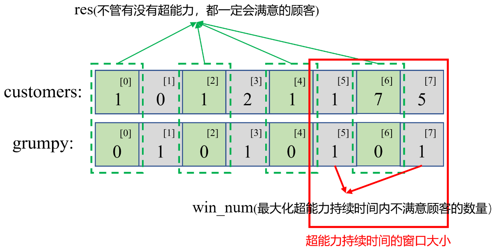

#### [1052. 爱生气的书店老板](https://leetcode-cn.com/problems/grumpy-bookstore-owner/)

今天，书店老板有一家店打算试营业 `customers.length` 分钟。每分钟都有一些顾客（`customers[i]`）会进入书店，所有这些顾客都会在那一分钟结束后离开。

在某些时候，书店老板会生气。 如果书店老板在第 `i` 分钟生气，那么 `grumpy[i] = 1`，否则 `grumpy[i] = 0`。 当书店老板生气时，那一分钟的顾客就会不满意，不生气则他们是满意的。

书店老板知道一个秘密技巧，能抑制自己的情绪，可以让自己连续 `X` 分钟不生气，但却只能使用一次。

请你返回这一天营业下来，最多有多少客户能够感到满意的数量。


**示例：**

```
输入：customers = [1,0,1,2,1,1,7,5], grumpy = [0,1,0,1,0,1,0,1], X = 3
输出：16
解释：
书店老板在最后 3 分钟保持冷静。
感到满意的最大客户数量 = 1 + 1 + 1 + 1 + 7 + 5 = 16.
```

 **提示：**

- `1 <= X <= customers.length == grumpy.length <= 20000`
- `0 <= customers[i] <= 1000`
- `0 <= grumpy[i] <= 1`

#### 解法一：滑动窗口（脾气不好，那就讨好尽可能多的不满意顾客）

解题思路：首先我们可以明确一点，不管老板有没有这个超能力，那些**在老板不生气时候满意的顾客数量**是一定的，所以当现在老板有了超能力之后，在超能力有效的时间窗口内，如何**让那些原本在老板生气时候的不满意顾客数量最大化**，就成了我们现在要解决的问题，所以简单总结下这个问题就是：

- **不管老板使不适用超能力，那些在老板不生气的时候会感到满意的顾客数量不变**
- **在超能力生效期间，如何最大化原本老板会生气从而导致会感到不满意顾客的数量**

上述的思路，转化为代码，就是**在`grumpy`中以`X`的长度为窗口里，最大化这段窗口中凡是为`1`的元素对应的`customers`的元素之和**

1. 首先计算出`res`，`res`代表不管老板有没有超能力，那些依旧在老板不生气时候的顾客数量，这些顾客数量是永远不会变的
2. 然后同时滑动`left`和`right`指针，`[left, right]`代表超能力持续的时间窗口，我们要做的就是找出这段窗口期内，不满意顾客的最大值

```python
from typing import List
class Solution:
    def maxSatisfied(self, customers: List[int], grumpy: List[int], X: int) -> int:
        res, N = 0, len(customers)
        for i in range(N):      # 先找出老板在没有超能力，且不生气时候的顾客数量
            if grumpy[i]==0:
                res+=customers[i]
        left, right, max_num, win_num = 0, 0, 0, 0
        while right<N:
            if grumpy[right]==1:            # 老板生气了，这时候超能力显现，让他不生气了
                win_num+=customers[right]   # 老板不生气了，那些原本不满意的顾客现在满意了
            while right-left+1>X:           # 超能力是有时效的，可不能超了
                if grumpy[left]==1:         # 超出超能力时效范围了，这时候老板又生气了
                    win_num-=customers[left]    # 老板生气了，那些原本满意的顾客现在又不满意了
                left+=1
            max_num = max(max_num, win_num)
            # 看看现在的超能力时效内，最多有多少不满意的顾客变满意了，赶紧记录下来，让他下次记得吃药维持超能力
            right+=1
        return res+max_num  # 原本满意的顾客永远是满意的 + 原本不满意的顾客变为满意的有多少呢？
```

```c++
#include<iostream>
#include<vector>
using namespace std;
class Solution {
public:
    int maxSatisfied(vector<int>& customers, vector<int>& grumpy, int X) {
        int res=0, N=customers.size();
        for(int i=0; i<N; i++)
        {
            if(grumpy[i]==0)
            {
                res+=customers[i];  //先找出老板在没有超能力，且不生气时候的顾客数量
            }
        }
        int left=0, right=0, max_num=0, win_num=0;
        while(right<N)
        {
            if(grumpy[right]==1)    //老板生气了，这时候超能力显现，让他不生气了
                win_num+=customers[right];  //老板不生气了，那些原本不满意的顾客现在满意了
            while(right-left+1>X)   //超能力是有时效的，可不能超了
            {
                if(grumpy[left]==1) //超出超能力时效范围了，这时候老板又生气了     
                    win_num-=customers[left];   //老板生气了，那些原本满意的顾客现在又不满意了
                left+=1;
            }
            max_num = max(max_num, win_num);
            // 看看现在的超能力时效内，最多有多少不满意的顾客变满意了，赶紧记录下来，让他下次记得吃药维持超能力
            right+=1;
        }
        return res+max_num; //原本满意的顾客永远是满意的 + 原本不满意的顾客变为满意的有多少呢？
    }
};
```

以下为代码的图示：

