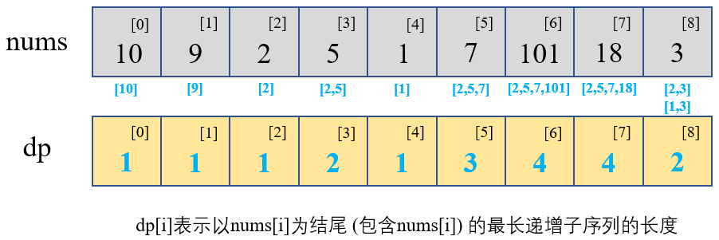

#### [300. 最长递增子序列](https://leetcode-cn.com/problems/longest-increasing-subsequence/)

给你一个整数数组 `nums` ，找到其中最长严格递增子序列的长度。

子序列是由数组派生而来的序列，删除（或不删除）数组中的元素而不改变其余元素的顺序。例如，`[3,6,2,7]` 是数组 `[0,3,1,6,2,2,7]` 的子序列。

**示例 1：**

```
输入：nums = [10,9,2,5,3,7,101,18]
输出：4
解释：最长递增子序列是 [2,3,7,101]，因此长度为 4 。
```

**示例 2：**

```
输入：nums = [0,1,0,3,2,3]
输出：4
```

**示例 3：**

```
输入：nums = [7,7,7,7,7,7,7]
输出：1
```

 **提示：**

- `1 <= nums.length <= 2500`
- `-104 <= nums[i] <= 104`

 **进阶：**

- 你可以设计时间复杂度为 `O(n2)` 的解决方案吗？
- 你能将算法的时间复杂度降低到 `O(nlog(n))` 吗?

#### 解法一：动态规划

**解题之前**：解题之前先来听个小故事：

- 四个壮士互吹牛皮，**A壮士说：我有2个手下败将！**
- B壮士心里想了想：我昨天刚和A比试完，**我能打过A，他都有2个手下败将**，那俩手下败将岂不也是我的手下败将？所以**B说：我有3个手下败将！**
- C壮士这时候听了B的话，心里也嘀咕了一阵：我跟A和B都过过招，**A和B都打不过我**，A有俩手下败将，B有仨手下败将，跟A比我有3个手下败将，跟B比我就有4个手下败将啦！所以**C说：我有4个手下败将！**
- D壮士听了之后，虚了：我之前**和他们仨都比试都输了**，那我有几个手下败将呢？所以**D说：我有1个手下败将，就是我自己！**

**解题思路**：首先我们明确一下，这道题问的是**最长递增子序列的长度**，而不是**最长递增子串**的长度，子序列可以元素不连续。然后我们看一下题目的问题能不能作为状态，题目问的是最长递增子序列的长度，那我们就可以把**最长递增子序列的长度**最为状态。所以这里还是按照动态规划的步骤来走

1. 【**确定 $dp$ 数组及其下标含义**】，我们定义 $dp[i]$ 表示以 $nums[i]$ 结尾的最长递增子序列的长度，注意这里是以 $nums[i]$ 结尾，且包含 $nums[i]$ 这个元素。这里我们先以【示例一】中的数组作为示范：

   

2. 确定好了 $dp$ 数组，现在需要确定一下【**状态转移方程**】。

   - 之前我们已经明确了这里面的【状态】是指什么：最长递增子序列的长度。那么现在我们思考一下这个【**状态**】怎么进行【**转移**】，也就是 $dp[i]$ 怎么由 $dp[i-1]$ 或 $dp[i-2]$ ,...,甚至 $dp[0]$ 确定出来。
   - 我们最初定义 $dp$ 数组的时候是这样定义的：$dp[i]$ 表示以 $nums[i]$ 结尾的最长递增子序列的长度，也就是说 $dp[i]$ 所表示的递增子序列的长度，是必须包含 $nums[i]$ 这个元素的，又因为是递增的子序列，所以以 $nums[i]$ 结尾的这个子序列的倒数第二个元素，一定比 $nums[i]$ 小！
   - 所以我们遍历 $nums[i]$ 之前的元素，找找看哪些是比 $nums[i]$ 小的元素，比如我们找到 $nums[a]$，$nums[b]$，$nums[c]$这三个元素比 $nums[i]$ 小，那我们就看看以这三个元素结尾的最长递增子序列的长度为多少，找出那个最长，然后那个最长的再加上 $nums[i]$ 这个元素，就是以 $nums[i]$ 结尾的最长递增子序列
   - 拿上图举例：
     - $nums[0]=10$，这是第一个元素，以这个元素结尾的最长递增子序列长度肯定为 $1$，$dp[0]=1$，不提；
     - 接下来要找以 $nums[1]=9$ 这个元素为结尾的最长递增子序列长度，那我们就遍历 $nums[1]=9$ 之前的元素，发现没有比$9$ 小的，那以 $9$ 结尾的最长递增子序列 $dp[1]=1$；
     - $nums[2]=2$ 同理，$dp[2]=1$，不提；
     - 当 $nums[3]=5$ 的时候，我们遍历 $nums[3]=5$ 之前的元素，发现 $nums[2]=2$ 比 $nums[3]=5$ 小，那我们就确定 $dp[3]=dp[2]+1=2$；
     - $nums[4]=1$ 之前没有比 $1$ 小的元素，$dp[4]=1$，不提；
     - 当遍历到 $nums[5]=7$ 的时候，我们逐个遍历 $nums[5]=7$ 之前的元素，看哪个比 $nums[5]=7$ 小：
       - $nums[2]=2$ 比 $nums[5]=7$ 小，我们暂且更新 $dp[5]=dp[2]+1=2$
       - $nums[3]=5$ 比 $nums[5]=7$ 小，发现更新了 $dp[5]=dp[3]+1=3$ 之后。比之前的 $dp[5]$ 大，所以我们就用这个最大的，表示用 $nums[3]=5$ 作为 $nums[5]=7$ 为结尾的递增子序列的次大值
       - $nums[4]=1$ 也比 $nums[5]=7$ 小，但是更新 $dp[5]=dp[4]+1=2$ 之后，没有原来的 $dp[5]=3$ 大，所以不更新 $dp[5]$
       - 遍历完 $nums[5]=7$ 之前所有比 $7$ 小的元素之后，发现 $dp[5]$ 最大为 $3$，那我们就确定了以 $nums[5]=7$ 结尾的最长递增子序列的长度为 $dp[5]=3$
     - 接下来继续往后遍历即可。这里我们可以使用一个变量 $max_len$ 用来保存我们所找到的最长的递增子序列的长度，此变量随着 $dp[i]$ 的更新而不断进行判断，若有更大者，则进行替换

3. 接下来我们【**确定 $dp$ 数组的初始值**】：$dp[i]$ 代表以 $nums[i]$ 结尾的最长递增子序列，如果不进行 $dp$ 迭代的话，就不能确定以 $nums[i]$ 为结尾的最长递增子序列长度为多少，只能暂定为只有它自己，所以我们可以初始化 $dp$ 数组的所有值都为 $1$

4. 我们从前往后遍历数组即可，因为 $dp[i]$ 的确定，需要遍历 $nums[i]$ 之前的所有元素

```Python
# Python3
from typing import List
class Solution:
    def lengthOfLIS(self, nums: List[int]) -> int:
        N, max_len = len(nums), 1
        dp = [1]*N
        for j in range(N):
            for i in range(j):
                if nums[j]>nums[i]:
                    dp[j] = max(dp[j], dp[i]+1)
                    max_len = max(max_len, dp[j])
        return max_len
```

```c++
// C++
#include <iostream>
#include <vector>
using namespace std;
class Solution {
public:
    int lengthOfLIS(vector<int>& nums) {
        int N=nums.size(), max_len=1;
        vector<int> dp(N, 1);
        for(int j=0; j<N; j++){
            for(int i=0; i<j; i++){
                if(nums[j]>nums[i]){
                    dp[j] = max(dp[j], dp[i]+1);
                    max_len = max(max_len, dp[j]);
                }
            }
        }
        return max_len; 
    }
};
```

复杂度分析：

- 时间复杂度：$O(n^2)$，这里动态规划中所有的【状态】数为 $n$，但是每次判断一个状态 $dp[i]$ 的时候，都需要遍历 $nums[i]$ 之前的所有值，所以总的时间复杂度为$O(n^2)$
- 空间复杂度：$O(n)$，$dp$ 数组的总长度为 $n$

参考资料：

- [@力扣官方题解：最长上升子序列](https://leetcode-cn.com/problems/longest-increasing-subsequence/solution/zui-chang-shang-sheng-zi-xu-lie-by-leetcode-soluti/)

- [@程序员Carl：关于动态规划，你该了解这些！](https://mp.weixin.qq.com/s?__biz=MzUxNjY5NTYxNA==&mid=2247486381&idx=1&sn=b8b913edabdab1208bf677b9578442e7&chksm=f9a238fcced5b1eae8b46972b5f4f9256651fd08d31e78d8aaaa530f56ee2919386cebb1da8a&scene=178&cur_album_id=1679142788606574595#rd)
- [@liweiwei1419：动态规划 （包含O (N log N) 解法的状态定义以及解释）](https://leetcode-cn.com/problems/longest-increasing-subsequence/solution/dong-tai-gui-hua-er-fen-cha-zhao-tan-xin-suan-fa-p/)

____

这是我第**31**篇题解，也是[@Dean](https://leetcode-cn.com/u/dean-98543/)连续刷题打卡的第**45**天，希望能找到可以一起刷题一起进步的小伙伴~

**刷题小白，编程语言也不熟悉，如有错误的地方，还请各位大佬多多指教~**