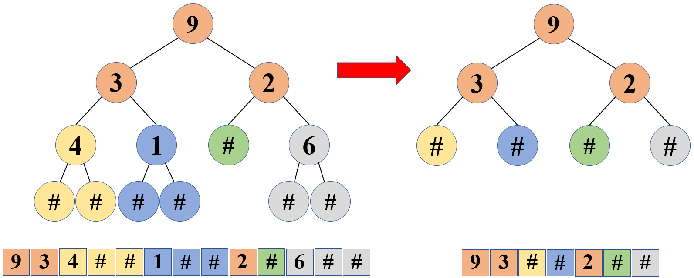

#### 331. 验证二叉树的前序序列化

序列化二叉树的一种方法是使用前序遍历。当我们遇到一个非空节点时，我们可以记录下这个节点的值。如果它是一个空节点，我们可以使用一个标记值记录，例如 `#`。

```
     _9_
    /   \
   3     2
  / \   / \
 4   1  #  6
/ \ / \   / \
# # # #   # #
```

例如，上面的二叉树可以被序列化为字符串 `"9,3,4,#,#,1,#,#,2,#,6,#,#"`，其中 `#` 代表一个空节点。

给定一串以逗号分隔的序列，验证它是否是正确的二叉树的前序序列化。编写一个在不重构树的条件下的可行算法。

每个以逗号分隔的字符或为一个整数或为一个表示 `null` 指针的 `'#'` 。

你可以认为输入格式总是有效的，例如它永远不会包含两个连续的逗号，比如 `"1,,3"` 。

**示例 1:**

```
输入: "9,3,4,#,#,1,#,#,2,#,6,#,#"
输出: true
```

**示例 2:**

```
输入: "1,#"
输出: false
```

**示例 3:**

```
输入: "9,#,#,1"
输出: false
```

**解题之前：**

首先，这道题中所示的前序序列，并不是真正的二叉树的前序序列，这道题将每个叶子节点的两个空子节点也作为一个节点进行序列化输出，非空节点的空子节点也作为一个节点进行序列化输出。所以这里面真正意义上的空子节点就是`'#'`。而每一个非空节点，填补了这个`‘#’`作为子节点之后，相当于这个二叉树里，除了`‘#’`之外，每一个节点都有两个子节点了！

##### 解法一：栈思想

1. 直接以示例1中的二叉树为例：

   

   由上图可以看到，节点`'4'`的两个`‘#’`节点，合并为一个`‘#’`节点，同理，**所有叶节点都和它的两个`‘#’`节点合并为一个`‘#’`节点**。所以，第一步可以消除掉所有的叶节点

2. 到第二步之后，所有的叶节点只有`‘3’`和`‘2’`两个，**每个叶节点也都有两个`‘#’`子节点**，这样也还是可以继续合并

   

3. 这个时候，只剩下一个叶节点，也就是只有一个根节点了，原来的两个叶节点都成为了`‘#’`节点，所以现在，这个根节点，也可以和它的两个`‘#’`继续合并

   

4. 可以看到，如果是一个正确的二叉树，最后会合并为一个`‘#’`节点！

5. 而具体到二叉树的前序序列中，我们可以发现上图所示的思想是这样的：

   

```python
# Python3
class Solution:
    def isValidSerialization(self, preorder: str) -> bool:
        ser = preorder.split(',')
        # if len(ser)&1==0:
        #     return False
        stk = []
        for c in ser:
            stk.append(c)
            while len(stk)>=3 and stk[-1]=='#' and stk[-2]=='#' and stk[-3]!='#':
                stk.pop()
                stk.pop()
                stk[-1] = '#'
        if stk:
            if len(stk)==1 and stk[-1]=='#':
                return True
        return False
```

小结一下：

- 时间复杂度：$O(N)$
- 空间复杂度：$O(N)$

解题之后：

- 这道题有个小方法，就是如果将二叉树中的所有非空节点的空子节点都以‘#’填充，则这个二叉树除了根节点之外，每一层的节点数都会是偶数，**所以整个二叉树前序序列化之后，这个序列的长度一定为奇数**。所以在拿到这个`preorder`之后，如果这个`preorder`中的节点个数为偶数，则一定不是某个二叉树的前序序列。

参考资料：

- [@力扣官方题解：验证二叉树的前序序列化](https://leetcode-cn.com/problems/verify-preorder-serialization-of-a-binary-tree/solution/yan-zheng-er-cha-shu-de-qian-xu-xu-lie-h-jghn/)
- [@负雪明烛：拍案叫绝的两种解法：「栈」和「入度出度」](https://leetcode-cn.com/problems/verify-preorder-serialization-of-a-binary-tree/solution/pai-an-jiao-jue-de-liang-chong-jie-fa-zh-66nt/)

____

这是我第**32**篇题解，也是[@Dean](https://leetcode-cn.com/u/dean-98543/)连续刷题打卡的第**52**天，希望能找到可以一起刷题一起进步的小伙伴~

**刷题小白，编程语言也不熟悉，如有错误的地方，还请各位大佬多多指教~**