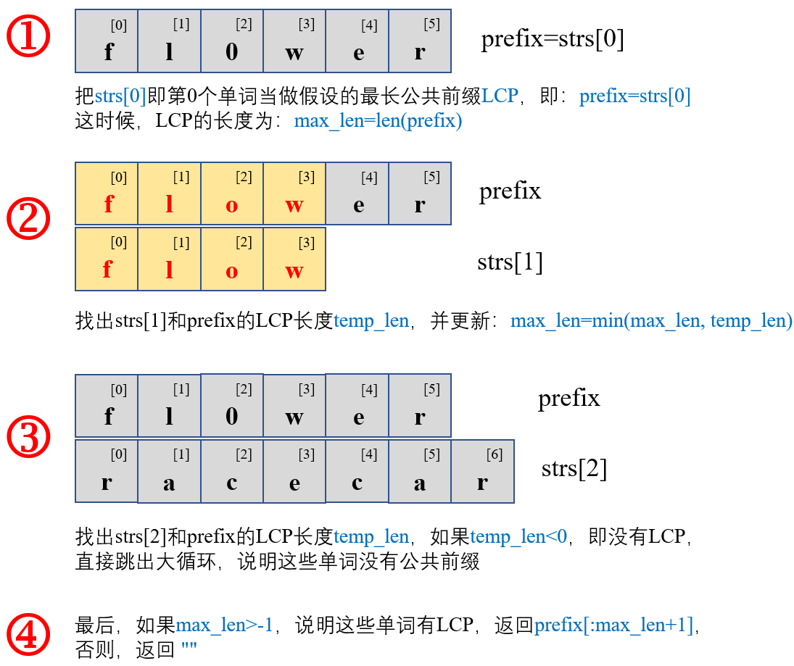
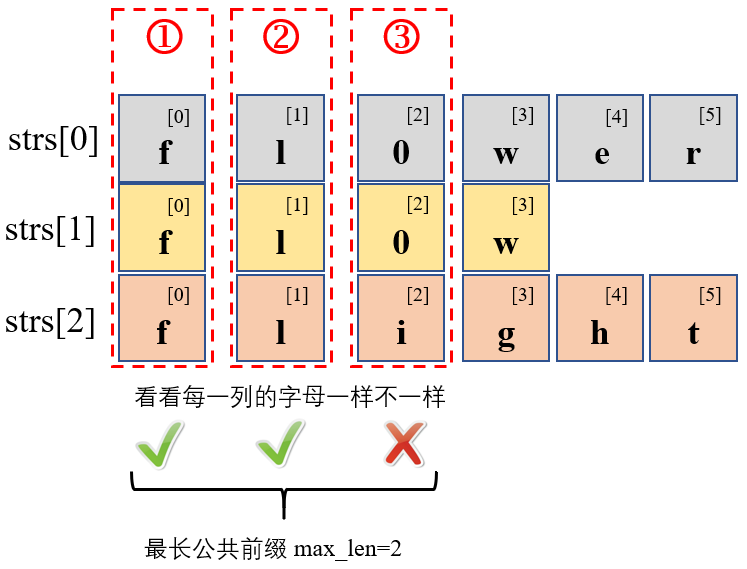

#### [14. 最长公共前缀](https://leetcode-cn.com/problems/longest-common-prefix/)

编写一个函数来查找字符串数组中的最长公共前缀。

如果不存在公共前缀，返回空字符串 `""`。

 **示例 1：**

```
输入：strs = ["flower","flow","flight"]
输出："fl"
```

**示例 2：**

```
输入：strs = ["dog","racecar","car"]
输出：""
解释：输入不存在公共前缀。
```

 **提示：**

- `0 <= strs.length <= 200`
- `0 <= strs[i].length <= 200`
- `strs[i]` 仅由小写英文字母组成

##### 解法一：横向扫描

解题思路：

1. 既然要找到最长公共前缀`LCP`，最特殊情况下，所有单词都一模一样，那`LCP`就是这个单词。所以我们可以事先假设一个单词为`LCP`，然后遍历剩余单词，找到最少的那个`LCP`，就是所有单词共有的`LCP`

2. 所以可以假设第零个单词`strs[0]`为`LCP`，然后遍历剩余单词，不断缩小`LCP`范围即可

3. 话不多说，直接上图：

   

```python
# Python3
from typing import List
class Solution:
    def longestCommonPrefix(self, strs: List[str]) -> str:
        N = len(strs)
        if N==0:    return ""
        prefix = strs[0]    # 将第0个单词当做最长公共前缀LCP
        max_len = len(prefix)   # 未遍历前将LCP的长度设置为第0个单词的长度
        for strIdx in range(N):
            temp_len = -1   # 假设当前遍历到的单词和第一个单词共有字母的索引为-1（即假设没有LCP）
            for i in range(min(len(strs[strIdx]), len(prefix))):
                if strs[strIdx][i]==prefix[i]:
                    temp_len = i    # 更新这个单词和第0个单词共有字母的索引
                else:
                    break   # 如果对应索引的字母不同，直接break
            max_len = min(max_len, temp_len)    # 更新所有遍历到的单词的LCP（取LCP长度的最小值）
            if max_len<0:   # 未遍历完所有单词时，有的单词已经和prefix没有公共前缀了，那还玩什么玩
                break
        return prefix[:max_len+1] if max_len > -1 else ""
```

##### 解法二：纵向扫描

解题思路：我们可以像切豆角一样，把每个单词想象成一根豆角，怼齐了豆角之后，切下第一刀，看切下来的豆角粒都一样不一样，一样则继续切，直到切出来的豆角粒有不一样的



```python
# Python3
from typing import List
class Solution:
    def longestCommonPrefix(self, strs: List[str]) -> str:
        N = len(strs)
        if N==0:    return ""
        for max_len in range(0, 201):
            for strIdx in range(1, N):
                if max_len >= min(len(strs[strIdx]), len(strs[strIdx-1])) \
                        or strs[strIdx][max_len]!=strs[strIdx-1][max_len]:
                    return strs[0][:max_len]
        return strs[0]
```

小结一下：

- 时间复杂度：$O(mn)$，两种解法的最坏情况下，所有单词都会遍历一遍
- 空间复杂度：$O(1)$，只使用常数个的辅助变量

____

这是我第**34**篇题解，也是[@Dean](https://leetcode-cn.com/u/dean-98543/)连续刷题打卡的第**55**天，希望能找到可以一起刷题一起进步的小伙伴~

**刷题小白，编程语言也不熟悉，如有错误的地方，还请各位大佬多多指教~**