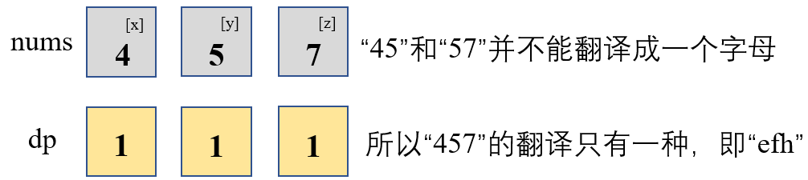
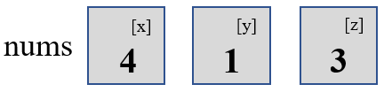
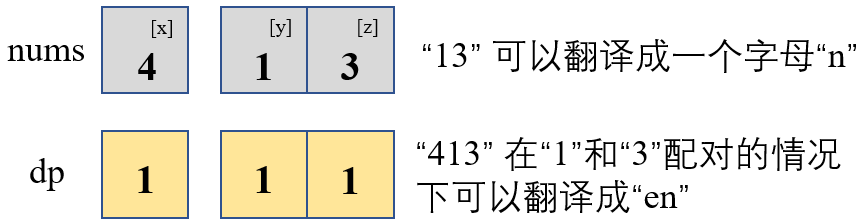
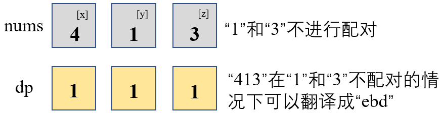
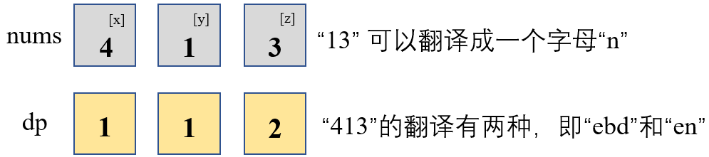

#### [剑指 Offer 46. 把数字翻译成字符串](https://leetcode-cn.com/problems/ba-shu-zi-fan-yi-cheng-zi-fu-chuan-lcof/)

给定一个数字，我们按照如下规则把它翻译为字符串：0 翻译成 “a” ，1 翻译成 “b”，……，11 翻译成 “l”，……，25 翻译成 “z”。

一个数字可能有多个翻译。请编程实现一个函数，用来计算一个数字有多少种不同的翻译方法。

**示例 1:**

```
输入: 12258
输出: 5
解释: 12258有5种不同的翻译，分别是"bccfi", "bwfi", "bczi", "mcfi"和"mzi"
```

**提示：**

- `0 <= num < 231`

**解题之前**：这道题第一眼看上去比较难，甚至没有思路，但是只要细想一下，数字开头的数字和尾端的数字各自翻译成的字符串是不相关的，也就是说，**如果两个数字`x`和y中间隔了两个以上的数字的话，那么`x`和`y`各自翻译成的字符串是毫不相关的**，所以我们就可以从头往后一步一步进行翻译，也就是运用动态规划的思想来做

##### 解法一：动态规划

1. 首先我们明确**动态数组`dp`及其下标含义**，其中`dp[i]`代表包括第`i`个数字之前的数字能够翻译成的字符串数目

2. 然后确定递推公式，也就是状态转移方程。这里先以相邻的`x`，`y`和`z`三个数字为例，然后再明确具体的公式：

   1. 暂且先不管`x`是数字几，也不管`x`能否与前后数字配对，我们暂定为【以`x`结尾的数字可以组成的字符串数量】为`dp[x]`（这里`x`不代表下标，仅代表【以`x`结尾的数字可以组成的字符串数量】）

   2. 同理也不管`y`是数字几，我们暂定【以`y`结尾的数字可以组成的字符串数量】为`dp[y]`（同上，这里`y`也不代表下标，仅代表【以`y`结尾的数字可以组成的字符串数量】）

   3. `z`也是一个数字，范围也必定在`[0,9]`之间。如果`y`和`z`不能进行配对（即`y=0`，或者`10 *y+z>25`），`z`就可以转换为单独的一个字母，那么【以`z`结尾的数字可以组成的字符串数量】和【以`y`结尾的数字组成字符串数量】相同，这时候`dp[z]=dp[y]`，如下图所示：

      

   4. 但是如果`y`和`z`可以进行配对（即`10<=10*y+z<=25`，说明`10*y+z`可以对应一个新的字母），那么就要分开讨论了，如下图所示的`x`，`y`和`z`的情况：

      

      - 如果考虑`y`和`z`搭配，即`y`和`z`搭配后组成了一个新的数字，该数字可以匹配一个单独的字母，那么【以`z`结尾的数字可以组成的字符串个数】就是`dp[z]=dp[x]`

        

      - 但是即使`y`和`z`可以搭配组成新字母，我们也可以不搭配啊，这时候，`y`和`z`分别对应其各自的字母，这时候就是**步骤3**讨论的【如果`y`和`z`不能进行配对】的情况一样了，这时候`dp[z]=dp[y]`

        

      - 所以在`y`和`z`可以匹配新字母的时候，`dp[z] = dp[x]+dp[y]`

        

   5. 综上，结合**第3步**和**第4步**讨论的情况，可以确定递推公式如下：
      $$
      \begin{cases}
      dp[i] = dp[i-2] + dp[i-1] & \text{10<=(i-1)*10+i<=25}\\
      dp[i] = dp[i-1]	& \text{其他}
      \end{cases}
      $$

3. `dp`数组初始化。可以通过上述**第2步**的讨论分析如何进行初始化：`dp[0]`不用说，第`0`个数字一定在`[1,9]`的范围内，所以`dp[0]=1`；而`dp[1]`则要根据第`0`个数字是否可以和第`1`个数字配对构成新字母来确定，如果可以配对，则`dp[1]=2`，否则`dp[1]=1`：
   $$
   \begin{cases}
   dp[0] = 1	\\
   dp[1] = 
   \begin{cases}
   2 & \text{10<=num[0]*10+num[1]<=25}\\
   1 & \text{其他}
   \end{cases}
   \end{cases}
   $$

4. 确定遍历顺序：从左往右遍历即可

```python
# Python3
class Solution:
    def translateNum(self, num: int) -> int:
        nums = [int(c) for c in str(num)]
        N = len(nums)
        if N == 0:    return 0
        if N == 1:    return 1
        dp = [0] * N
        dp[0] = 1
        dp[1] = 2 if 10 <= 10*nums[0]+nums[1] <= 25 else 1
        for i in range(2, N):
            if 10 <= 10*nums[i-1]+nums[i] <= 25:
                dp[i] = dp[i - 2] + dp[i - 1]
            else:
                dp[i] = dp[i - 1]
        return dp[-1]
```

```c++
// C++
#include<iostream>
#include<vector>
using namespace std;
class Solution {
public:
    int translateNum(int num) {
        vector<int> nums;
        for(auto num:to_string(num)){
            nums.push_back((int)num-(int)('0'));
        }
        int N = nums.size();
        if(N==0)    return 0;
        if(N==1)    return 1;
        vector<int> dp(N,0);
        dp[0] = 1;
        dp[1] = (nums[0]!=0) && (nums[0]*10+nums[1]<=25)?2:1;
        for(int i=2; i<N; i++){
            if((nums[i-1]!=0) && (nums[i-1]*10+nums[i]<=25))
                dp[i] = dp[i-2] + dp[i-1];
            else
                dp[i] = dp[i-1];
        }
        return dp[N-1];
    }
};
```

小结一下：

- 时间复杂度：$O(n)$，只需遍历一遍`nums`即可
- 空间复杂度：$O(n)$，可以使用滚动数组进行优化，但这里为方便理解起见未使用滚动数组

____

这是我第**37**篇题解，也是[@Dean](https://leetcode-cn.com/u/dean-98543/)连续刷题打卡的第**59**天，希望能找到可以一起刷题一起进步的小伙伴~

**刷题小白，编程语言也不熟悉，如有错误的地方，还请各位大佬多多指教~**